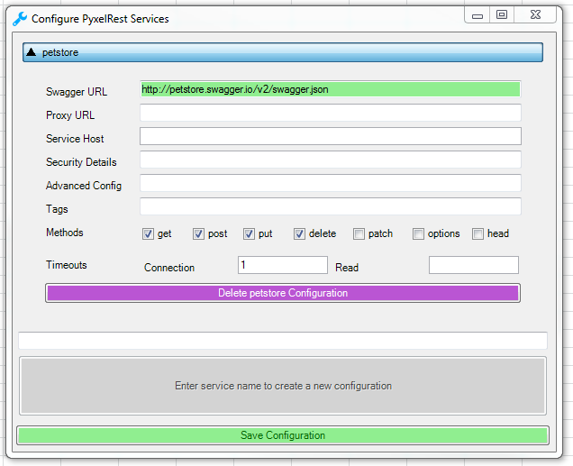

# Access REST APIs from Excel using User Defined Functions (UDF) #

PyxelRest allow you to query [Swagger 2.0/OpenAPI](https://www.openapis.org) REST APIs using Excel User Defined Functions.

1. [Usage](#Usage)
2. [Installation](#Installation)
3. [Configuration](#Configuration)

## Usage ##

Once installed, open Microsoft Excel and UDFs from configured services will be available.

UDFs are automatically updated on Excel start and on Configuration update.

Updating UDFs without restarting Excel or updating configuration can be done thanks to the ``Update Functions`` button within ``PyxelRest`` tab.

## Installation ##

### User installation ###

1. Within Excel, `Trust access to the VBA project object model` should be enabled.
> File > Options > Trust Center > Trust Center Settings > Macro Settings
2. Excel must be closed while executing the following command:

        pip install pyxelrest

### User upgrade ###

1. Excel must be closed while executing the following command:

        pip install pyxelrest --upgrade

### User uninstall ###

1. Go to `Control Panel/Programs and Features` and uninstall AutoLoadPyxelRestAddIn.
2. Execute the following command:

        pip uninstall pyxelrest
3. Remove `%APPDATA%\pyxelrest` folder.
4. Remove `%APPDATA%\Microsoft\Excel\XLSTART\pyxelrest.xlam` file.

### Developer Installation/Upgrade ###

1. Within Excel, `Trust access to the VBA project object model` should be enabled.
> File > Options > Trust Center > Trust Center Settings > Macro Settings
2. Build the addin C# solution:
In order to do so, you need to add a test certificate.
> Project > AutoLoadPyxelRestAddIn > Signing
3. Excel must be closed while executing the following script from within pyxelrest root folder:

        developer_install.bat

### Optional Dependencies ###

- Support for `application/msgpackpandas`
    - Pandas encoded msgpack will be used if `pandas` and `msgpack-python` modules are available.

## Configuration ##

### Services Configuration ###

Services configuration can be done within Excel thanks to the `Configure Services` button within `PyxelRest` tab.

Configuration can also be manually updated thanks to `%APPDATA%\pyxelrest\services_configuration.ini` file.

Each section name will be used as the UDFs category.

Each UDF will be prefixed by the section name (only [a-zA-Z0-9_] characters will be kept).

The following options are available for each section:

<table>
    <th>
        <td>Description</td>
        <td>Mandatory</td>
        <td>Possible values</td>
    </th>
    <tr>
        <td>swagger_url</td>
        <td>Complete URL to the Swagger definition.</td>
        <td>Mandatory</td>
        <td></td>
    </tr>
    <tr>
        <td>proxy_url</td>
        <td>Proxy that should be used to reach service.</td>
        <td>Optional</td>
        <td></td>
    </tr>
    <tr>
        <td>service_host</td>
        <td>Service host in case your service is behind a reverse proxy.</td>
        <td>Optional</td>
        <td></td>
    </tr>
    <tr>
        <td>methods</td>
        <td>List of services methods to be exposed as UDFs.</td>
        <td>Optional</td>
        <td>get, post, put, delete</td>
    </tr>
</table>

### Logging Configuration ###

Logging configuration can be updated thanks to `%APPDATA%\pyxelrest\logging_configuration.ini` file.

Default log files can be found in your `%APPDATA%\pyxelrest` folder.

This folder can easily be accessed thanks to the `Open User Folder` button within `PyxelRest` tab.
