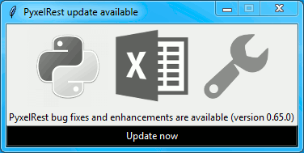

Access REST APIs from Microsoft Excel using User Defined Functions (UDF)
========================================================================
PyxelRest allow you to query `Swagger 2.0/OpenAPI <https://www.openapis.org>`_ REST APIs using Microsoft Excel User Defined Functions.

Usage
-----

Once installed, open Microsoft Excel and UDFs from configured services will be available.

.. figure:: addin/AutoLoadPyxelRestAddIn/resources/screenshot_udfs_category.PNG
   :align: center

   Selecting UDF

.. figure:: addin/AutoLoadPyxelRestAddIn/resources/screenshot_udf_arguments.PNG
   :align: center

   Filling in UDF parameters

UDFs are automatically updated on Microsoft Excel start and on Configuration update.

Updating UDFs without restarting Microsoft Excel or updating configuration can be done thanks to the ``Update Functions`` button within ``PyxelRest`` tab.

.. figure:: addin/AutoLoadPyxelRestAddIn/resources/screenshot_pyxelrest_auto_load_ribbon.PNG
   :align: center

   Microsoft Excel add-in

PyxelRest itself can automatically stay up to date.
The updater make sure that the python module, the Microsoft Excel add-in and the services configuration stays up to date.

   Update steps

Installation
------------
Pre requisites
--------------

- [Python >= 2.7](https://www.python.org/downloads/) must be installed.
- [Microsoft Excel >= 2010](https://products.office.com/en-us/excel) must be installed.
- [Microsoft .NET Framework >= 4.5.2](http://go.microsoft.com/fwlink/?linkid=328856) must be installed.

User Installation (using PIP)
-----------------------------

#. Within Microsoft Excel, ``Trust access to the VBA project object model`` should be enabled.
> File > Options > Trust Center > Trust Center Settings > Macro Settings
#. Microsoft Excel must be closed while executing the following command:
        >>> pip install pyxelrest

User add-in installation
------------------------

One python module is installed, a script is available to install the Microsoft Excel add-in.

The add-in is not installed at the same time as the module because:
    * It may prompt the user for installation.
    * pyxelrest can be used as a python module without the need for the add-in.

Considering %scripts_dir% as the directory containing python scripts (Scripts folder within your virtual environment).

Install Microsoft Excel add-in by executing the following command:
        >>> python %scripts_dir%\pyxelrest_install_addin.py

The following options are available when launching this script:

+------------------------------------+------------------------------------------------------------------------------------------------------------------------------------+-----------------------------------------------------------------------+
|                                    | Description                                                                                                                        | Possible values                                                       |
+====================================+====================================================================================================================================+=======================================================================+
| --add_in_directory                 | Directory containing PyxelRest Microsoft Excel auto load add-in.                                                                   | Default to ..\pyxelrest_addin relatively to the scripts directory.    |
+------------------------------------+------------------------------------------------------------------------------------------------------------------------------------+-----------------------------------------------------------------------+
| --vb_add_in_directory              | Directory containing PyxelRest Microsoft Visual Basic add-in.                                                                      | Default to ..\pyxelrest_vb_addin relatively to the scripts directory. |
+------------------------------------+------------------------------------------------------------------------------------------------------------------------------------+-----------------------------------------------------------------------+
| --scripts_directory                | Directory containing installed Python scripts.                                                                                     | Default to the folder containing this script.                         |
+------------------------------------+------------------------------------------------------------------------------------------------------------------------------------+-----------------------------------------------------------------------+
| --path_to_up_to_date_configuration | Path to up to date configuration file(s). This path will be used in case of auto update to keep services configuration up to date. | Can be file, folder paths or an URL to a file.                        |
+------------------------------------+------------------------------------------------------------------------------------------------------------------------------------+-----------------------------------------------------------------------+

User Uninstall (using PIP)
--------------------------

1. Uninstall AutoLoadPyxelRestAddIn.
2. Execute the following command:
        >>> pip uninstall pyxelrest
3. Remove ``%APPDATA%\pyxelrest`` folder.
4. Remove ``%APPDATA%\Microsoft\Excel\XLSTART\pyxelrest.xlam`` file.

Developer Installation (using PIP)
----------------------------------

1. Within Microsoft Excel, ``Trust access to the VBA project object model`` should be enabled.
> File > Options > Trust Center > Trust Center Settings > Macro Settings
2. Build the add-in C# solution:
In order to do so, you need to add a test certificate.
> Project > AutoLoadPyxelRestAddIn > Signing
3. Microsoft Excel must be closed while executing the following script from within pyxelrest root folder:
        >>> developer_install.bat

Optional Dependencies
---------------------

- Support for ``application/msgpackpandas``
    - Pandas encoded msgpack will be used if ``pandas`` and ``msgpack-python`` modules are available.

- Support for ``ujson``
    - JSON responses deserialization (when rely_on_definitions is set to True) will rely on ``ujson`` in case ``ujson`` module is available.

- Support for ``requests_ntlm``
    - ``requests_ntlm`` is required in case auth=ntlm is set in ``security_details`` property and custom credentials are provided.

- Support for ``requests_negotiate_sspi``
    - ``requests_negotiate_sspi`` is required in case auth=ntlm is set in ``security_details`` property and logged in user credentials should be used.

- Support for ``cachetool``
    - ``cachetool`` is required to be able to use in-memory caching.

Configuration
-------------

Services Configuration
----------------------

Services configuration can be done within Microsoft Excel thanks to the ``Configure Services`` button within ``PyxelRest`` tab.

.. figure:: addin/AutoLoadPyxelRestAddIn/resources/screenshot_pyxelrest_auto_load_ribbon.PNG
   :align: center

   Microsoft Excel add-in

.. figure:: addin/AutoLoadPyxelRestAddIn/resources/screenshot_configure_pyxelrest_services.PNG
   :align: center

   Configuration screen

Configuration can also be manually updated thanks to ``%APPDATA%\pyxelrest\configuration\services.yml`` file.

File is following [YAML](http://yaml.org/start.html) formatting.

Each section name will be used as the UDFs category.

Each UDF will be prefixed by the section name (only [a-zA-Z0-9_] characters will be kept).

The following options are available for each section:

Values can be environment variables if provided in the form %MY_ENV_VARIABLE% (for MY_ENV_VARIABLE environment variable).

+-------------------------+----------------------------------------------------------------------------------------------------------------------------------------------------------------+-----------+----------------------------------------------+
|                         | Description                                                                                                                                                    | Mandatory | Possible values                              |
+=========================+================================================================================================================================================================+===========+==============================================+
| open_api                | Dictionary describing the OpenAPI definition. Refer to OpenAPI section for more information.                                                                   | Mandatory |                                              |
+-------------------------+----------------------------------------------------------------------------------------------------------------------------------------------------------------+-----------+----------------------------------------------+
| description             | A small description of this service. To be displayed within Microsoft Excel add-in services configuration screen.                                              | Optional  |                                              |
+-------------------------+----------------------------------------------------------------------------------------------------------------------------------------------------------------+-----------+----------------------------------------------+
| proxies                 | Proxies that should be used to reach service. This is a dictionary where keys are the scheme (http or https) and/or no_proxy.                                  | Optional  |                                              |
|                         | If the key is a scheme then the value should be the proxy URL.                                                                                                 |           |                                              |
|                         | Otherwise the value should be the URL for which proxies should be ignored.                                                                                     |           |                                              |
|                         | For more details refer to http://docs.python-requests.org/en/master/user/advanced/#proxies                                                                     |           |                                              |
+-------------------------+----------------------------------------------------------------------------------------------------------------------------------------------------------------+-----------+----------------------------------------------+
| service_host            | Service host in case your service is behind a reverse proxy.                                                                                                   | Optional  |                                              |
+-------------------------+----------------------------------------------------------------------------------------------------------------------------------------------------------------+-----------+----------------------------------------------+
| methods                 | List of services methods to be exposed as UDFs. Retrieve all standards HTTP methods by default (get, post, put, delete, patch, options, head).                 | Optional  | get, post, put, delete, patch, options, head |
+-------------------------+----------------------------------------------------------------------------------------------------------------------------------------------------------------+-----------+----------------------------------------------+
| oauth2                  | Dictionary containing OAuth2 related settings. Refer to OAuth 2 section for more information.                                                                  | Optional  |                                              |
+-------------------------+----------------------------------------------------------------------------------------------------------------------------------------------------------------+-----------+----------------------------------------------+
| api_key                 | User API Key.                                                                                                                                                  | Optional  |                                              |
+-------------------------+----------------------------------------------------------------------------------------------------------------------------------------------------------------+-----------+----------------------------------------------+
| basic                   | Dictionary containing Basic authentication related settings. Refer to Basic section for more information.                                                      | Optional  |                                              |
+-------------------------+----------------------------------------------------------------------------------------------------------------------------------------------------------------+-----------+----------------------------------------------+
| ntlm                    | Dictionary containing NTLM related settings. Refer to NTLM section for more information.                                                                       | Optional  |                                              |
+-------------------------+----------------------------------------------------------------------------------------------------------------------------------------------------------------+-----------+----------------------------------------------+
| udf_return_types        | List of user defined function return types.                                                                                                                    | Optional  | asynchronous or synchronous.                 |
|                         | synchronous if you want your UDF to return the final result immediately.                                                                                       |           |                                              |
|                         | It means that you will have to specify all the cells that will contains the result.                                                                            |           |                                              |
|                         | asynchronous by default.                                                                                                                                       |           |                                              |
+-------------------------+----------------------------------------------------------------------------------------------------------------------------------------------------------------+-----------+----------------------------------------------+
| max_retries             | Maximum number of time a request should be retried before considered as failed. 5 by default.                                                                  | Optional  | Any positive integer value                   |
+-------------------------+----------------------------------------------------------------------------------------------------------------------------------------------------------------+-----------+----------------------------------------------+
| headers                 | Dictionary containing headers where key is the name of the header that should be sent with every request sent to this service.                                 | Optional  |                                              |
+-------------------------+----------------------------------------------------------------------------------------------------------------------------------------------------------------+-----------+----------------------------------------------+
| connect_timeout         | Maximum amount of time, in seconds, to wait when trying to reach the service. Wait for 1 second by default.                                                    | Optional  | any float value                              |
|                         | For more details refer to http://docs.python-requests.org/en/master/user/advanced/#timeouts                                                                    |           |                                              |
+-------------------------+----------------------------------------------------------------------------------------------------------------------------------------------------------------+-----------+----------------------------------------------+
| read_timeout            | Maximum amount of time, in seconds, to wait when requesting a service. Infinite wait by default.                                                               | Optional  | any float value                              |
|                         | For more details refer to http://docs.python-requests.org/en/master/user/advanced/#timeouts                                                                    |           |                                              |
+-------------------------+----------------------------------------------------------------------------------------------------------------------------------------------------------------+-----------+----------------------------------------------+
| skip_update_for         | List of section names that should not be auto-updated.                                                                                                         | Optional  |                                              |
+-------------------------+----------------------------------------------------------------------------------------------------------------------------------------------------------------+-----------+----------------------------------------------+

OpenAPI
-------

+-------------------------+----------------------------------------------------------------------------------------------------------------------------------------------------------------+-----------+----------------------------------------------+
|                         | Description                                                                                                                                                    | Mandatory | Possible values                              |
+=========================+================================================================================================================================================================+===========+==============================================+
| definition              | URL to the OpenAPI definition. http, https and file scheme are supported. For more details on what is a URL, please refer to https://en.wikipedia.org/wiki/URL | Mandatory |                                              |
+-------------------------+----------------------------------------------------------------------------------------------------------------------------------------------------------------+-----------+----------------------------------------------+
| definition_read_timeout | Maximum amount of time, in seconds, to wait when requesting an OpenAPI definition. Wait for 5 seconds by default.                                              | Optional  | any float value                              |
|                         | For more details refer to http://docs.python-requests.org/en/master/user/advanced/#timeouts                                                                    |           |                                              |
+-------------------------+----------------------------------------------------------------------------------------------------------------------------------------------------------------+-----------+----------------------------------------------+
| excluded_tags           | List of tags within OpenAPI definition that should not be retrieved. If not specified, no filtering is applied.                                                | Optional  |                                              |
|                         | For more details refer to https://github.com/OAI/OpenAPI-Specification/blob/master/versions/2.0.md                                                             |           |                                              |
+-------------------------+----------------------------------------------------------------------------------------------------------------------------------------------------------------+-----------+----------------------------------------------+
| selected_tags           | List of tags within OpenAPI definition that should be retrieved (if not within excluded tags already). If not specified, no filtering is applied.              | Optional  |                                              |
|                         | For more details refer to https://github.com/OAI/OpenAPI-Specification/blob/master/versions/2.0.md                                                             |           |                                              |
+-------------------------+----------------------------------------------------------------------------------------------------------------------------------------------------------------+-----------+----------------------------------------------+
| rely_on_definitions     | Rely on OpenAPI definitions to re-order fields received in JSON response. Deactivated by default.                                                              | Optional  | true or false                                |
+-------------------------+----------------------------------------------------------------------------------------------------------------------------------------------------------------+-----------+----------------------------------------------+
| service_host            | Service host in case your service is behind a reverse proxy.                                                                                                   | Optional  |                                              |
+-------------------------+----------------------------------------------------------------------------------------------------------------------------------------------------------------+-----------+----------------------------------------------+

OAuth 2
-------

If response_type is not provided in authorization_url, token is expected to be received in "token" field.

+----------------------+------------------------------------------------------------------------------------------------------------------------------------------------------------------+-----------+
|                      | Description                                                                                                                                                      | Mandatory |
+======================+==================================================================================================================================================================+===========+
| port                 | Port on which the authentication response is supposed to be received. Default value is 5000.                                                                     | Optional  |
+----------------------+------------------------------------------------------------------------------------------------------------------------------------------------------------------+-----------+
| timeout              | Maximum number of seconds to wait for the authentication response to be received. Default value is 1 minute.                                                     | Optional  |
+----------------------+------------------------------------------------------------------------------------------------------------------------------------------------------------------+-----------+
| success_display_time | Amount of milliseconds to wait before closing the authentication response page on success and returning back to Microsoft Excel. Default value is 1 millisecond. | Optional  |
+----------------------+------------------------------------------------------------------------------------------------------------------------------------------------------------------+-----------+
| failure_display_time | Amount of milliseconds to wait before closing the authentication response page on failure and returning back to Microsoft Excel. Default value is 5 seconds.     | Optional  |
+----------------------+------------------------------------------------------------------------------------------------------------------------------------------------------------------+-----------+
| XXXX                 | Where XXXX is the name of the parameter in the authorization URL. You can find more details on https://tools.ietf.org/html/rfc6749#section-4.2.1                 | Optional  |
+----------------------+------------------------------------------------------------------------------------------------------------------------------------------------------------------+-----------+

Basic
-----

+----------+----------------+-----------+
|          | Description    | Mandatory |
+==========+================+===========+
| username | User name.     | Mandatory |
+----------+----------------+-----------+
| password | User password. | Mandatory |
+----------+----------------+-----------+

NTLM
----

Requiring ``requests_ntlm`` or ``requests_negotiate_sspi`` python modules.

+----------+------------------------------------------------------------------------------------------+-----------+
|          | Description                                                                              | Mandatory |
+==========+==========================================================================================+===========+
| username | User name. Should be of the form domain\\user. Default value is the logged in user name. | Optional  |
+----------+------------------------------------------------------------------------------------------+-----------+
| password | User password. Default value is the logged in user password.                             | Optional  |
+----------+------------------------------------------------------------------------------------------+-----------+

PyxelRest Service Configuration
-------------------------------

You can also use the "pyxelrest" service name to activate [Postman](https://www.getpostman.com )-like UDFs.

.. figure:: addin/AutoLoadPyxelRestAddIn/resources/screenshot_configure_pyxelrest_service.PNG
   :align: center

   Configuration screen

.. figure:: addin/AutoLoadPyxelRestAddIn/resources/screenshot_udfs_pyxelrest_category.PNG
   :align: center

   Selecting UDF

It can be configured the same way than a usual service, except that open_api section is not used anymore.

Logging Configuration
---------------------

PyxelRest logging configuration can be updated thanks to ``%APPDATA%\pyxelrest\configuration\logging.ini`` file.

PyxelRest auto-update logging configuration can be updated thanks to ``%APPDATA%\pyxelrest\configuration\auto_update_logging.ini`` file.

Microsoft Excel Auto-Load add-in logging configuration can be updated thanks to ``%APPDATA%\pyxelrest\configuration\addin.config`` file.

Default log files can be found in your ``%APPDATA%\pyxelrest\logs`` folder.

This folder can easily be accessed thanks to the ``Open Logs`` button within ``PyxelRest`` tab.

.. figure:: addin/AutoLoadPyxelRestAddIn/resources/screenshot_pyxelrest_auto_load_ribbon.PNG
   :align: center

   Microsoft Excel add-in

Microsoft Excel Auto-Load add-in Configuration
----------------------------------------------

Auto check for update can be activated/deactivated within Microsoft Excel thanks to the ``Check for update on close`` button within ``PyxelRest`` tab.

.. figure:: addin/AutoLoadPyxelRestAddIn/resources/screenshot_pyxelrest_auto_load_ribbon.PNG
   :align: center

   Microsoft Excel add-in

Configuration can also be manually updated thanks to ``%APPDATA%\pyxelrest\configuration\addin.config`` file.

The following application settings are available:

+------------------------------+------------------------------------------------------------------------------------------------+-----------+-------------------------------------------------------------+
|                              | Description                                                                                    | Mandatory | Possible values                                             |
+==============================+================================================================================================+===========+=============================================================+
| PathToPython                 | Path to the python.exe (including) executable that should be used to launch the update script. | Mandatory | Installation script is already setting this value properly. |
+------------------------------+------------------------------------------------------------------------------------------------+-----------+-------------------------------------------------------------+
| PathToUpdateScript           | Path to the Python script used to update PyxelRest.                                            | Mandatory | Installation script is already setting this value properly. |
+------------------------------+------------------------------------------------------------------------------------------------+-----------+-------------------------------------------------------------+
| AutoCheckForUpdates          | Activate or Deactivate automatic check for PyxelRest update on Microsoft Excel closing.        | Optional  | True (default), False                                       |
+------------------------------+------------------------------------------------------------------------------------------------+-----------+-------------------------------------------------------------+
| GenerateUDFAtStartup         | Activate or Deactivate generation of user defined functions at Microsoft Excel startup.        | Optional  | True (default), False                                       |
+------------------------------+------------------------------------------------------------------------------------------------+-----------+-------------------------------------------------------------+
| PathToXlWingsBasFile         | Path to the Python script used to update PyxelRest.                                            | Mandatory | Default value is already set.                               |
+------------------------------+------------------------------------------------------------------------------------------------+-----------+-------------------------------------------------------------+
| PathToUpToDateConfigurations | Path to the file or directory containing up to date services configuration.                    | Optional  | Installation script is already setting this value properly. |
+------------------------------+------------------------------------------------------------------------------------------------+-----------+-------------------------------------------------------------+

Using as a module
-----------------

You can use pyxelrest as a python module as well::

   import pyxelrest

   # Avoid the following import statement to generate UDFs
   pyxelrest.GENERATE_UDF_ON_IMPORT = False

   from pyxelrest import pyxelrestgenerator

   # Generate UDFs for the following import
   services = pyxelrestgenerator.generate_user_defined_functions()
   pyxelrestgenerator.reload_user_defined_functions(services)

   from pyxelrest import user_defined_functions

   # UDFs are available as python functions within user_defined_functions and can be used as such

Generating user defined functions
---------------------------------

When ::GENERATE_UDF_ON_IMPORT:: is set to ::True:: (default behavior), UDFs are generated by loading (e.g. on first import) pyxelrest.pyxelrestgenerator.py.

You can manually regenerate UDFs by calling ::pyxelrest.pyxelrestgenerator.generate_user_defined_functions()

All UDFs can be found within pyxelrest.user_defined_functions.py.

Caching results
---------------

For testing purposes mainly, you can cache UDFs calls by using pyxelrest.caching.py.
This serves as an automatic mocking feature.

The call to caching init method must be done prior to generating UDFs.

On disk
-------

::init_disk_cache(<filename>):: must be called to initialize the disk cache file.

In memory
---------

This cache has an expiry in second and a maximum size.
::init_memory_cache(<maxsize>,<expiry>):: must be called to initialize the memory cache.

The cachetools module is required for this feature to be available.

Frequently Asked Question
-------------------------

Microsoft Excel Wizard does not show any parameter
--------------------------------------------------

In case your UDF has a lot of parameters, then Microsoft Excel is unable to display them all in the function wizard.

Try reducing the number of parameters in your service.

No command specified in the configuration, cannot autostart server
------------------------------------------------------------------

This error will happen in case you manually specified in your xlwings.bas file to use debug server but did not uncomment the main function starting the server on pyxelrest module side.

Microsoft Excel Add-In cannot be installed
------------------------------------------

Check that all requirements are met:
- [Microsoft .NET Framework >= 4.5.2](http://go.microsoft.com/fwlink/?linkid=328856) must be installed.
- [Microsoft Visual Studio 2010 Tools for Office Runtime](https://www.microsoft.com/en-us/download/details.aspx?id=48217) must be installed.

In case you encounter an issue like `Could not load file or assembly 'Microsoft.Office.BusinessApplications.Fba...` anyway, you then need to remove `C:\Program Files\Common Files\Microsoft Shared\VSTO\10.0\VSTOInstaller.exe.config` file.

In case you encounter an issue like `...An application with the same identity is already installed...`, you then need to manually remove all folders within `%USERPROFILE%\AppData\Local\Apps\2.0` and restart your computer.

Dates with a year higher than 3000 are not converted to local timezone
----------------------------------------------------------------------

Due to timestamp limitation, dates after `3000-12-31` and date time after `3001-01-01T07:59:59+00:00` cannot be converted to local timezone.
